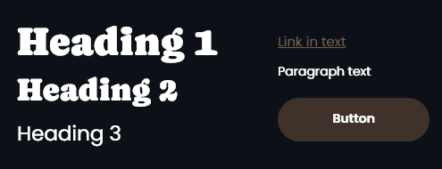
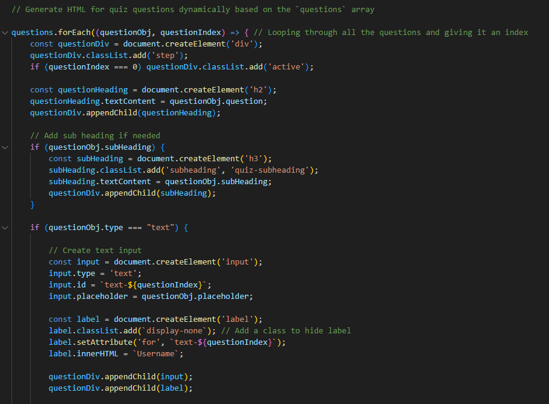

# Welcome to "Find your ideal dog breed" Quiz!


This quiz is designed to help you discover the perfect dog breed for your lifestyle and personality. Developed by [Sunne Dogcare](https://fridalannerstrom.github.io/dogsitter/), it reflects our belief that choosing a dog is one of the most important decisions a future dog owner can make. By understanding your needs, habits, and preferences, we hope to guide you toward a breed that will thrive in your care.

As a dog sitter, I see firsthand the consequences of impulsive dog purchases. Too often, people choose a breed based on looks, trends, or recommendations from friends without considering the breed’s unique characteristics and compatibility with their lifestyle. While I love caring for these dogs, I can’t help but wish that more owners had made informed decisions from the start.

This quiz is our way of promoting thoughtful dog ownership. By answering a series of fun and insightful questions, you’ll gain a better understanding of which breed aligns with your daily life, ensuring a harmonious and happy relationship between you and your future furry friend.

[Find your paw-fect match with this quiz! 🐾](https://fridalannerstrom.github.io/my-dog-breed/) 

# Table of content

1. [User Experience (UX)](#user-experience-ux)
   - [Purpose of the Quiz](#purpose-of-the-Quiz) 
   - [Graphic Design & Color Scheme](#graphic-design--color-scheme) 
   - [UI/UX Design](#uiux-design) 

2. [Features](#features)
   - [Pages](#pages)
   - [Key Elements](#key-elements)
   - [Additional Features](#additional-features)
   - [Feature Changes](#Feature-changes)
   - [Logic behind the quiz](#Logic-behind-the-quiz)
   - [Future changes](#Future-changes)
   
3. [Tools and Technologies](#tools-and-technologies)
   - [Languages](#languages)
   - [Libraries](#libraries)
   - [Development Tools](#development-tools) 
   - [Other Tools](#other-tools)
   
4. [Testing](#testing)
   - [Code validation](#code-validation) 
   - [Browser Compatibility](#browser-compatibility) 
   - [Responsiveness](#responsiveness) 
   - [Pagespeed Insights](#pagespeed-insights) 
   - [Bugs and result testing](#bugs-and-result-testing) 
   - [Unfixed Bugs](#unfixed-bugs) 
   
5. [Deployment](#deployment)
   - [Local Deployment](#local-deployment) 
   - [GitHub Deployment](#github-deployment)
   
6. [Credits](#credits)
   - [Content & Media](#content-media)
   - [Other](#other)
   - [Acknowledgements](#acknowledgements)


# User Experience (UX)

## Purpose of the Quiz

This quiz has one simple goal: to help you discover which dog breed is the best match for your lifestyle and personality. There are no distractions, no unnecessary elements, and no clutter — just a clean and straightforward experience. A clear CTA button invites users to start the quiz, with concise, engaging text to guide them.

While we provide a link back to Sunne Dogcare for those interested, this is not intended to act as an advertisement for the service. The focus remains solely on helping potential dog owners make thoughtful decisions about their future furry companions.

### Target Group:

- **Potential dog owners** - Individuals considering getting a dog but are unsure which breed suits their lifestyle and personality best.
- **First-Time dog owners** - People who have never owned a dog before and need guidance to make an informed decision.
- **Curious dog enthusiasts** - Dog lovers who may already have a dog but are curious about which other breeds might be a good match for them.

### How the quiz achieves its goal
We’ve designed the quiz with simplicity and accessibility in mind, ensuring users can focus entirely on the task at hand. Here’s how:

| Feature | Description | 
| ------- | ----------- | 
| **Bright, Inviting Colors** | We use soft, natural tones to create a welcoming environment. | 
| **Illustrations of beautiful dogs** | Eye-catching visuals enhance the user experience and make the quiz enjoyable. |
| **Bold and clear text** | Short, simple instructions ensure users can easily follow along without confusion. | 
| **Straightforward Call-to-Action** | A single, prominent button directs users to start the quiz. |
| **Clear and simple questions** | Designed to be easy to understand, ensuring a smooth flow from start to finish. | 
| **Overview of top dog breed** | After completing the quiz, users are presented with their best match and receive clear, concise information about the breed. | 
| **Discover additional matches** | Users can also see their other top three potential breeds for broader insights and more options. | 


## Graphic Design & Color Scheme

The design of this quiz is intentionally simple, with a strong focus on text and illustrations. By avoiding distractions, the user can focus entirely on the content. The overall feel is warm, light, and trustworthy, brought to life through charming illustrations of various dog breeds.

### Color Scheme

- **Primary Colors:** Warm shades of brown set the tone for the quiz. Brown was chosen for its natural, earthy feel, evoking the outdoors, animals, and a connection to dogs. Many dogs are brown themselves, making this color both symbolic and relatable.
- **Neutral Accents:** Supporting neutral tones provide balance and ensure the content remains the primary focus without overwhelming the user.

Together, these colors create a natural and inviting atmosphere that aligns perfectly with the theme of dog ownership.

 

### Fonts

- **Headline Font (Caprasimo):** Large, bold, and eye-catching, this font is used for titles, questions, and results to immediately grab attention. Its slightly playful curves soften the boldness, adding a friendly yet professional tone.
- **Body Text Font (Poppins):** A clean and widely used sans-serif font, chosen for its excellent readability on all devices. It complements the boldness of Caprasimo, ensuring paragraphs and subheadings remain easy to read and visually appealing.

This pairing strikes the perfect balance, guiding the user’s eye naturally from headlines to supporting information.

 

### Headings, Buttons and Links

- **Caprasimo** for headings (H1, H2)
- **Poppins** for paragraphs and H3 (Poppins used instead of Caprasimo for H3 due to better readability).
- **Links** are styled in brown with an underline, maintaining a cohesive design that aligns with the overall aesthetic.
- **Buttons** are large and brown used consistently throughout the quiz. Their prominent size and simplicity make them stand out, ensuring users can easily interact with the quiz.

 

 ### Icons

A single type of icon, a paw print from [Font Awesome](https://fontawesome.com/) is used to provide visual information. For example, a breed’s energy level might be represented by five paw prints, with the number of filled paw prints indicating the level of activity. This simple visual system makes it quick and easy for users to interpret important information about each breed.

 

### Illustrations

Instead of photographs, the quiz features illustrations of various dog breeds. These illustrations, sourced from [Flaticon.com](https://www.flaticon.com/) and created by [Maxim Kulikov](https://www.flaticon.com/authors/maxim-kulikov), bring a cohesive and playful touch to the design. The illustrations represent each breed accurately while maintaining an unified artistic style, enhancing the overall user experience.

 

## UI/UX Design

The focus of the UI/UX design process for this quiz was to create a versatile and intuitive interface that accommodates different types of questions and results. Since the exact wording of the quiz questions is still being refined at this point, the primary goal was to establish a design framework that supports various question formats. Each mockups also includes one or more selected options.

<details>
  <summary>🖥️ Click to view UI Mockups of questions</summary>

| Purpose | Description | 🖥️ Desktop | 💻 Tablet | 📱 Mobile |
| ------- | ----------- | ------- | ------ | ------ |
| **Checkbox questions** | For questions where users can select multiple answers |  |  |  | 
| **Radio Button question** | For questions where users can select only one option  |  |  |  | 
| **Image-Based answers** | For questions where users can select based on images |  |  |  | 
| **Text-Based answers with descriptions** | For questions where options require a description |  |  |  | 
| **Text-Based answers without descriptions** | For questions where options does not require a description |  |  |  | 


</details>

<br>
In addition to the question layouts, the quiz consists of three main page elements. Each page is designed for clarity and usability, ensuring a seamless experience. Below is an overview of their purpose:

<br>

<details>
  <summary>🖥️ Click to view UI Mockups of pages</summary>


| Purpose | Description | 🖥️ Desktop | 💻 Tablet | 📱 Mobile |
| ------- | ----------- | ------- | ------ | ------ |
| **Intro page** | Landing page with a clear CTA to start the quiz. |  |  |  | 
| **Result page** | Displays the best match, additional breeds, and key details. |  |  |  | 
| **404** | Error page with a message and navigation back to the main page. |  |  |  | 


</details>


<br>

The final design for the UI were created using [Adobe XD](https://adobexdplatform.com/). The overall goal was to create a clean, engaging, and accessible design that guides users seamlessly through the quiz while keeping the experience visually appealing and user-friendly. This structure ensures flexibility for adjustments as the content evolves, without compromising the design's functionality or aesthetics.

⚠️ As the project progresses, the design will undergo changes, with new features being added and visual elements refined. Additionally, some text will be updated to improve clarity and enhance the overall user experience, ensuring the quiz remains intuitive and easy to navigate.

---


# Features

The website consists of a total of <strong>3 page sections</strong> and <strong>2 pages</strong>.

## Pages

| Page | Purpose | 🖥️ Screenshot |
| ---- | ------- | ----------- |
| **Index** | Serves as the main landing page for the quiz. |  | 
| **404** | Redirects users from broken links back to index page. |  | 

### Sections on index page

| Page section | Purpose | 🖥️ Screenshot |
| ------------ | ------- | ---------- | 
| **Intro** | Welcomes users and introduces the quiz with a clear CTA. |  | 
| **Quiz** | Displays a list of questions for users to determine their best dog match. |  | 
| **Result** | Presents the user's top dog breed match, other breeds and friends breed match |  | 

## Key Elements

### Intro

The Intro section is designed to immediately capture the user's attention and set the tone for the quiz. Here's a breakdown of its key elements:

| Section | Description | 📱 Mobile | 💻 Tablet | 🖥️ Desktop |
| ------- | ----------- | ------ | ------ | ------- |
| **Intro** | The Intro immediately engages users with charming illustrations of various dog breeds, creating a welcoming and relevant atmosphere. A bold title, "Find your ideal dog breed," clearly communicates the purpose of the quiz, while a brief supporting text explains its goal: helping users discover the best dog breed for their lifestyle and personality. The design is centered around a clear call-to-action button, "Start Quiz," which stands out prominently, guiding users to begin their journey effortlessly. |  |  |  | 

### Quiz

The quiz is designed with a consistent layout to ensure an intuitive and seamless user experience. Each question type is presented in a clear and engaging format, with concise content and a logical flow. To maintain user focus, the design uses minimal distractions while providing visually distinct formats for different question types. Below is a breakdown of the quiz sections:

| Section | Description | 📱 Mobile | 💻 Tablet | 🖥️ Desktop |
| ------- | ----------- | --------- | ------ | ---------- |
| **Text input** | Questions where users provide free-text answers, featuring a clean and simple layout. |  |  |  | 
| **Answers without description** | Questions with clear answer options but no additional descriptions shown with block layout |  |  |  | 
| **Answers with description** | Questions offering answers with accompanying short descriptions for clarity shown in inline layout |  |  |  | 
| **Answers with images** | Visual questions where users select from image-based answer options. |  |  |  | 

### Result

The results page displays the dog breed that best matches you based on your answers. It provides essential information in a clear and visually engaging way, using icons to highlight key traits and characteristics that are useful for potential new dog owners. Additionally, the page suggests three other breeds that might suit you, giving you more options to explore. You can also view your friends’ results, adding a social and interactive element to the experience. There is also a button to redo the quiz.

| Section | Description | 📱 Mobile | 💻 Tablet | 🖥️ Desktop |
| ------- | ----------- | --------- | ------ | ---------- |
| **Result section overview** | The results page highlights your best-matched breed, additional suitable breeds, and friends' results, all presented with clear details and visual cues for easy understanding. |  |  |  | 
| **Best match** | This section highlights your best-matched dog breed, providing a detailed description, key traits, and an easy-to-read visual rating of its characteristics. |  |  |  | 
| **Other breeds** | This section suggests three alternative dog breeds that align with your preferences, providing a brief description and illustration for each. |  |  |  | 
| **Friends results** | This section displays the results of your friends who have taken the quiz on the same device. The results are stored locally using browser local storage, allowing you to compare and view the dog breeds they were matched with. |  |  |  | 


## Additional Features

| Feature | Description | 🖥️ Screenshot |
| ------- | ----------- | ------------- | 
| **Empty Input Alert** | A notification appears when a field is left empty, prompting users to complete the input. |  | 
| **Saved Name Display** | The user's name, entered in the form, is saved and dynamically displayed on the results page. |  | 


## Feature Changes

Throughout the development process, changes were made to the design and text. These adjustments were necessary to ensure a better user experience. The changes are listed below.

| Action | Section | Reason | 🖥️ Screenshot | 
| ------ | ------- | ------ | ------------- | 
| **✅Addition** | Quiz | During the project, I chose to add a text field to the quiz to save the user's name. This allows for a more personalized experience, as the name can be displayed on the results page. |  | 
| **✅Friends results** | Result page | I also decided to include the three most recent quiz results on the results page. This feature, saved locally on the user's device, allows for easy comparison and adds an interactive, social element to the quiz experience. |  | 
| **🎨Design change** | Result page | To accommodate the friends' results, your additional matching breeds had to be displayed in a different layout on the results page. |  |


# Logic behind the quiz

The quiz consists of **14 questions** that can lead to one of **20 possible dog breeds**. Both the questions and the dog breeds are structured as objects in separate JavaScript files, which are imported into script.js. The JavaScript code is designed to be dynamic, meaning that if you add new dog breeds or questions, they will automatically be incorporated into the quiz form and included as potential results.

The selection of the 20 dog breeds was carefully curated to represent a broad range of sizes, behaviors, and needs. This variety ensures that the quiz provides meaningful and diverse results that can match different lifestyles and preferences. Each answer option contributes points to one or more dog breeds, with more points awarded if the answer aligns strongly with a breed’s characteristics and fewer points if it aligns less.

To organize the logic, I have used Notion to document the questions, calculations for matching breeds, and detailed information about the breeds themselves. The questions, information, and calculations are primarily based on my own experience as a dog sitter and my personal opinions on which dogs are best suited for different types of people and lifestyles. This hands-on knowledge was further complemented by ChatGPT, which helped refine questions and validate assumptions about how various breeds adapt to environments such as living with children, being alone often, or living in apartments.

This combination of practical experience and external input ensures that the quiz provides accurate, thoughtful, and personalized recommendations for potential dog owners.

[View page in Notion](https://sedate-molybdenum-41d.notion.site/Dog-Breed-Quiz-14d284e4604f8023bdc2c8624cf3393a?pvs=4)

## JavaScript changes

### Move dog data to seperate file

Initially, I had included all the dog breeds directly in the JavaScript file. However, as the number of breeds grew along with the amount of data, I decided to move the data to a separate file for better organization and maintainability.

### Move questions to seperate file

Initially, I had the questions and data points directly in the HTML. However, as the number of questions and breeds grew, it became increasingly difficult to manage them. Additionally, some answer options required descriptions or even images. To address this, I decided to move the questions to a separate file and generate the HTML quiz form dynamically using JavaScript.

| Before | After - seperate file | After - generate code | 
| ----- | ------- | ------- | 
|  |  |  | 

## Future changes

There are, of course, many improvements that could be made, such as adding more dog breeds and creating more engaging, interactive questions. However, there is one particular part of the code that I’m not entirely satisfied with. It’s the section where the result is generated, and the correct elements are placed in the appropriate spots in the HTML. This code should be refactored into a loop using keys, rather than the current implementation.


# Tools and Technologies


## Languages
This project is built using [HTML](https://en.wikipedia.org/wiki/HTML), [CSS](https://en.wikipedia.org/wiki/CSS) and [JavaScript](https://simple.wikipedia.org/wiki/JavaScript)

## Libraries
- **[Google Fonts](https://fonts.google.com/)**  
  Used for the fonts *Caprasimo* and *Poppins*.

- **[Font Awesome](https://fontawesome.com/)**  
  Used for icons.

## Development Tools
- **[GitHub](https://github.com/)**  
  Used for online code storing and deployment.

- **[Gitpod](https://fontawesome.com/)**  
  IDE used for development.

## Other Tools
- **[Favicon Generator](https://www.favicon-generator.org/)**  
  Used for generating favicon versions.

- **[Google Developer Tools](https://developer.chrome.com/docs/devtools)**  
  Used for testing and identifying my code

- **[Browserling](https://www.browserling.com/)**  
  Used for testing the website in different browsers

- **[WAVE](https://wave.webaim.org/)**  
  Used to test accessibility in design and website.

- **[Page Insights](https://pagespeed.web.dev/)**  
  Used to test speed, SEO and preformance.

- **[JSlint](https://www.jslint.com/)**  
  Used to text JavaScript code

## Testing

### Code validation

I have validated my HTML code using **[HTML W3C Validator](https://validator.w3.org/)**, CSS code using **[CSS Jigsaw Validator](https://validator.w3.org/)** and JS code using **[JSHint](https://jshint.com/)**

#### HTML

| Page      | Status   | Screenshot | 
| --------- | -------- | ---------- | 
| Index  | ✅ Pass | | 
| 404  | ✅ Pass |  | 

#### CSS

| File      | Status   | Screenshot | 
| --------- | -------- | ---------- | 
| style.css  | ✅ Pass |  | 

#### JS

| File      | Status   | Screenshot | 
| --------- | -------- | ---------- | 
| script.js | ✅ Pass |  | 
| dogData.js | ✅ Pass |  | 
| questions.js | ✅ Pass |  | 

### Browser Compatibility

The website has been tested using **[Browserling](https://www.browserling.com/)** to ensure functionality across a variety of web browsers. It has been confirmed to work on the following browsers:

- ✅ Chrome
- ✅ Safari
- ✅ Opera
- ✅ Firefox
- ✅ Brave
- ✅ Edge

### Responsiveness

Throughout the project, I prioritized responsive design by continuously testing with Google Developer Tools. Each new feature was tested on both small and large screen sizes to ensure optimal performance. I tested all available screen sizes in Google Developer Tools, and the website displays correctly across all devices.

- The design is optimized for extra-large screens, smaller desktop monitors, tablets, and phones.
- On extra-small phones, the info box om the result page has been removed to ensure the layout remains functional and visually clean.

### Pagespeed Insights

| Page      | Mobile   | Desktop | 
| --------- | -------- | ---------- | 
| Index  |  |  | 
| 404 |  |  | 


### Bugs and result testing

| Bug       |  Description | Solution  |
| --------- | --------- | ---------- | 
| Dog breeds never showing up | I encountered an issue where small dogs appeared as results, even when I selected that I didn’t want small dogs. | To solve this, I assigned very high points to the size preference chosen by the user, ensuring it outweighs all other factors. Similarly, for breeds that should be excluded based on certain answers, like a beginner being matched with a German Shepherd, I assigned very low scores (e.g., -100) to push those breeds to the bottom of the ranking. | 
| Balancing Dog Breeds in the Quiz | Some dog breeds, like Border Collie or Boxer, rarely appear as results during testing, even though they should. | To address this, I reviewed and adjusted the scoring system to ensure all breeds have a fair chance of being matched based on user preferences and quiz answers. However, this still needs more work. | 


### Unfixed Bugs

None that I know of - feel free to tell me if you find any!

## Deployment

### Local Deployment
To run this project locally, follow these basic steps:

Requirements:
- An IDE of your choice 
- Git
- A web browser

**Local Instructions:**

1. Clone the repository by running the following command in your terminal

```bash
git clone https://github.com/YOUR-USERNAME/your-repository.git
```

2. Navigate to the folder where the repository was cloned.

```bash
cd your-repository
```

3. Open the folder in your IDE.

4. Launch the project by opening the index.html file in your preferred web browser.

### GitHub Deployment

The project is deployed on GitHub Pages. To deploy your own version, follow these steps:

1. Log in to your GitHub account. navigate to https://github.com/fridalannerstrom/my-dog-breed
2. You can set up your own repository and copy or clone it, or you fork the repository.
3. GitHub pages will update from the master branch by default.
4. Go to the Settings page of the repository.
5. Scroll down to the Github Pages section.
6. Select the Master Branch as the source and Confirm the selection.
7. Wait a minute or two and it should be live for viewing. 

---

## Credits

### Content & Media

| Source      | Notes   | 
| ----------- | ---------- | 
| [Flaticon](https://www.flaticon.com/)  | Illustrations of dog breeds | 
| [ChatGPT](https://chatgpt.com/)  | Assisted with content creation and quiz result counting | 
| [Mockup Generator](https://techsini.com/multi-mockup/index.php)  | Used for generating mockup image in this README | 

### Other

| Source      | Notes   | 
| ----------- | ---------- | 
| [CloudConvert](https://cloudconvert.com/) | Converted PNG images to WebP format | 
| [W3Schools ](https://www.w3schools.com/) | Helped guide me and remind me about HTML, CSS and JavaScript | 
| [mdn web docs](https://developer.mozilla.org/en-US/docs/Web/API/Window/localStorage) | Helped me understand localstorage | 
| [Conventional Commits](https://www.conventionalcommits.org/en/v1.0.0/)  | Introduced me to a structured and meaningful way of writing commit messages, which I adopted halfway through the project | 


### Acknowledgements

- A huge thank you to my mentor, [Rory Patrick](https://github.com/Ri-Dearg), for providing invaluable guidance throughout this project.
- Special thanks to [Code Institute](https://codeinstitute.net/), particularly the "Love Maths" project, for helping me get started with GitHub and guiding me through the project process. 
